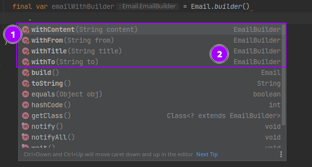

The **StepBuilder** pattern is a derivative of [Builder pattern](https://www.geeksforgeeks.org/builder-design-pattern/). 
You may never have heard about this pattern as it is not common to find it mentioned in books/articles about design patterns.

This design pattern is part of the **object creation** design pattern category.
It helps to create an instance of a class, but in a more assisted way than a builder would do.

## What does it solve

As opposite to a general builder, the step builder assist the developer providing guidance during the object creation.

Each steps declare the next step so that the developer can not do any mistake or forget some mandatory steps.


Here is an example using traditional builder for an email:



As we can see in point `(1)` the autocomplete show us methods: `.withContent()`, `.withFrom()`, `.withTitle()`, `.withTo()` methods and `.build()` right after having invoked `.builder()`.

Which means that we could simply write the following code and have something perfectly fine regarding compilation:

```java
// Example: Builder pattern weakness - can build empty objects
final var email = Email.builder()
  .build();
```

Does it make sense to have an `Email` instance without any from, to properties set ? Not really...

> question "But the build() method could check for that and ensure that required fields are provided no ?"
> That's perfectly right. But remember: **it will only display the issue at runtime**. 

Wouldn't it be better if we could enforce a bit the autocomplete to provide only invokable methods ?

Step builder pattern address this issue:


Using step builder pattern you no longer can forget to define `from`, `to`, `title`, `content` properties when creating an `Email` instance.
Furthermore the order is controlled. As you can see we can not call `.setContent()` method in the beginning. There is a sequence which define in which order each method can be called.

## Cool but how does it works ?

The trick is to use a specific interface per step.

```java
// Email.java - StepBuilder implementation
@Getter
@ToString
public class Email {
  private final String from;
  private final String to;
  private final String title;
  private final String content;

  private Email(final Builder builder) {
    from = builder.from;
    to = builder.to;
    title = builder.title;
    content = builder.content;
  }

  public static IFrom builder() { // (1) <-- here we expect IFrom 
    return new Builder();
  }

  public interface IFrom { // (2) <-- IFrom declares ITo withFrom(String val)
    ITo withFrom(String val);
  }

  public interface ITo { // (3) <-- ITo -> ITitle -> IContent
    ITitle withTo(String val);
  }

  public interface ITitle { // (4) <-- ITitle -> IContent 
    IContent withTitle(String val);
  }

  public interface IContent { // (5) <-- IContent -> IBuild 
    IBuild withContent(String val);
  }

  public interface IBuild { // (6) <-- IBuild -> Email instance! Woohoo :) 
    Email build();
  }

  public static final class Builder implements IContent, ITitle, ITo, IFrom, IBuild {
    private String content;
    private String title;
    private String to;
    private String from;

    private Builder() {
    }

    @Override
    public IBuild withContent(final String val) {
      content = val;
      return this;
    }

    @Override
    public IContent withTitle(final String val) {
      title = val;
      return this;
    }

    @Override
    public ITitle withTo(final String val) {
      to = val;
      return this;
    }

    @Override
    public ITo withFrom(final String val) {
      from = val;
      return this;
    }

    public Email build() {
      return new Email(this);
    }
  }
}
```

This code can be written by hand but let's be honest it would be much easier with a generator no ? Good news, a lot of generator exists for multiple IDE.

If you are using IntelliJ I suggest you this plugin that I maintain: [stepbuilder-codegen](https://plugins.jetbrains.com/plugin/16792-stepbuilder-codegen).

You can generate this code in a very few steps.


## Conclusion
As usual for design pattern you can find my example implementation [here](https://github.com/sebastienvermeille/java-design-patterns/tree/main/step-builder).

This pattern provide compile time issue when an object is not correctly constructed which is definitely a plus. 
I like the fluent coding style which render the code much more intuitive. This is like some UX design for developers using your API.


I see it as a quality when an API provide such way of using it. I was used to `Mockito` (a testing library for Java) which provide some fluent API too.

## References
* [IntelliJ plugin to generate StepBuilder](https://plugins.jetbrains.com/plugin/16792-stepbuilder-codegen).
* [Svlada article](https://www.svlada.com/step-builder-pattern/)
* [Martin Fowler - FluentInterface](https://martinfowler.com/bliki/FluentInterface.html)