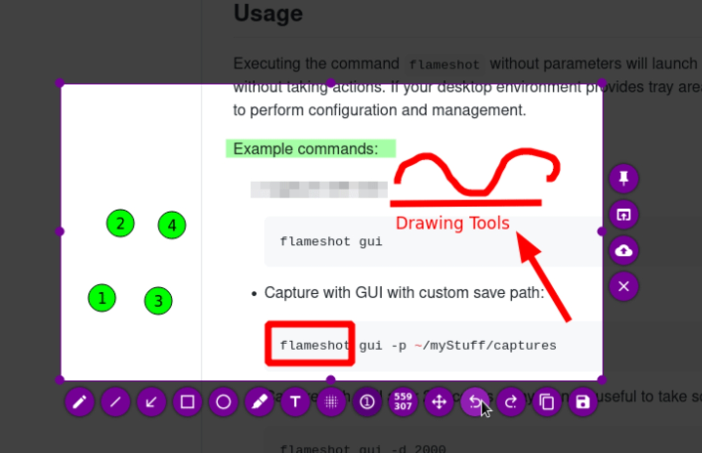

## Introduction

As developer we have to explain stuff. This is our DNA, explain how the program works, explain where the user has to click and so on.

I falled in love with this great tool called **Flameshot** which works on Linux Mac and Windows and is totally free.

## How it works

Just push your `prt scr` shortcut and then you are in!

As you can see there are plenty of usefull tools which appears, first you select the area which interest you (crop).

And then you can:
* Draw squares, arrows, lines, circles, free draw
* Add texts
* Add numbered circles (they increment at each click very handy!)
* You can blur some sensitive data
* ...

You can download it here: [https://flameshot.org/#download](https://flameshot.org/#download)

## Conclusion

A super powerful tool for free and which does the job!

## References
* [Flameshot - Official website](https://flameshot.org/)