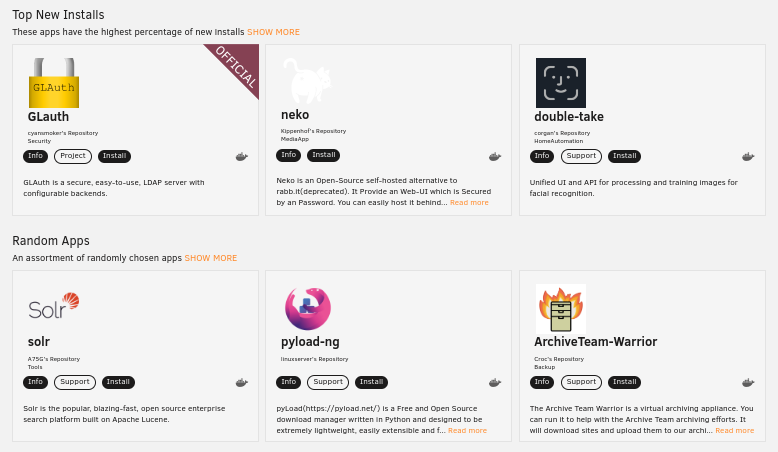
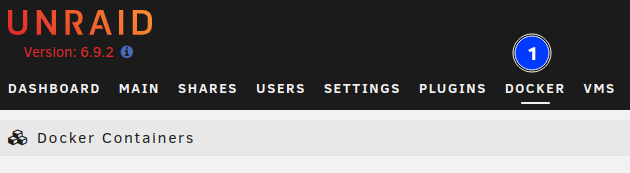
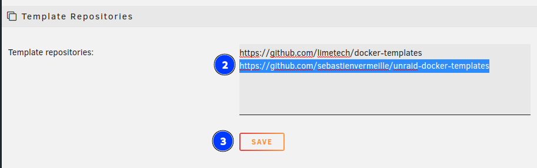
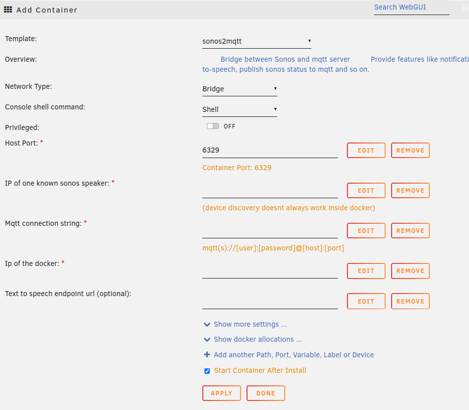

Unraid provide an App store via its [community app plugin](https://forums.unraid.net/topic/38582-plug-in-community-applications/):



With this it becomes really easy for everyone to install any app on Unraid: Just click install and voila your Unraid server is up and running.

What about publishing your own app there ? Wouldn't it be a great way to let it get adopted by the whole unraid community ? 

If you ask me I will tell you: **Yes definitely!**

Furthermore this is totally free and very easy compared to some other ecosystems.

Let's have a look about that!

## Create your own app store

I created mine here if you are interested in the end results feel free to have a look: [https://github.com/sebastienvermeille/unraid-docker-templates](https://github.com/sebastienvermeille/unraid-docker-templates)

Let's see how it works:

1) First you have to create a public git repository (on github or whatever)
2) Then inside of it we will declare some templates for our docker applications.

Here is the template I have created for `sonos2mqtt` app:
```xml
sonos2mqtt.xml

<?xml version="1.0"?>
<Container version="2">
    <Name>sonos2mqtt</Name>
    <Registry>https://hub.docker.com/r/svrooij/</Registry>
    <Repository>svrooij/sonos2mqtt</Repository>
    <Github>https://github.com/svrooij/sonos2mqtt</Github>
    <Network>bridge</Network>
    <MyIP/>
    <Privileged>false</Privileged>
    <Support>https://svrooij.github.io/sonos2mqtt</Support>
    <Project/>
    <Overview>
        Bridge between Sonos and mqtt server
        Provide features like notifications or text-to-speech, publish sonos status to mqtt and so on.
    </Overview>
    <Category>HomeAutomation:</Category>
    <WebUI>http://[IP]:[PORT:8080]/status</WebUI>
    <TemplateURL/>
    <Icon>https://raw.githubusercontent.com/sebastienvermeille/unraid-docker-templates/main/images/mqtt2sonos_icon.png</Icon>
    <ExtraParams/>
    <PostArgs/>
    <DateInstalled>1527397055</DateInstalled>
    <DonateText/>
    <DonateLink/>
    <DonateImg/>
    <MinVer/>
    <Description>It is very important to set the `Ip of this docker (sonos listener host)` field correctly otherwise the web
        ui won't work. (You can run this container without then grab the ip edit and set it)</Description>
    <Networking>
        <Mode>bridge</Mode>
        <Publish>
            <Port>
                <HostPort>6329</HostPort>
                <ContainerPort>6329</ContainerPort>
                <Protocol>tcp</Protocol>
            </Port>
        </Publish>
    </Networking>
    <Data>
        <Volume>
            <HostDir>/mnt/user/appdata/sonos2mqtt</HostDir>
            <ContainerDir>/data</ContainerDir>
            <Mode>rw</Mode>
        </Volume>
    </Data>
    <Environment/>
    <Labels/>
    <Config Name="Host Port" Target="6329" Default="6329" Mode="tcp" Description="Container Port: 6329" Type="Port" Display="always"
            Required="true" Mask="false">6329</Config>
    <Config Name="IP of one known sonos speaker" Target="SONOS2MQTT_DEVICE" Default=""
            Description="(device discovery doesnt always work inside docker)" Type="Variable" Display="always" Required="true"
            Mask="false"></Config>
    <Config Name="Mqtt connection string" Target="SONOS2MQTT_MQTT" Default=""
            Description="mqtt(s)://[user]:[password]@[host]:[port]" Type="Variable" Display="always" Required="true"
            Mask="false"></Config>
    <Config Name="Publish distinct (optional)" Target="SONOS2MQTT_DISTINCT" Default="true"
            Description="Publish distinct or not" Type="Variable" Display="advanced" Required="false"
            Mask="false">true</Config>
    <Config Name="Ip of this docker (sonos listener host)" Target="SONOS_LISTENER_HOST" Default=""
            Description="" Type="Variable" Display="always" Required="true"
            Mask="false"></Config>
    <Config Name="AppData Config Path" Target="/config" Default="/mnt/user/appdata/sonos2mqtt" Mode="rw"
            Description="Container Path: /config"
            Type="Path" Display="advanced-hide" Required="true" Mask="false">/mnt/user/appdata/sonos2mqtt</Config>
    <Config Name="Text to speech endpoint url (optional)" Target="SONOS_TTS_ENDPOINT" Default=""
            Description="" Type="Variable" Display="always" Required="false"
            Mask="false"></Config>
    <Config Name="Text to speech language (optional)" Target="SONOS_TTS_LANG" Default="en-US"
            Description="" Type="Variable" Display="always" Required="false"
            Mask="false"></Config>
</Container>
```
As you can see it's just a simple xml file declaring a bit ports, environment variables, paths and so on.

You can define here multiple type of configurations:
* Variable: ENV variable name
* Port: A port mapping
* Path: A path exposed

For more details you can read this page of [unraid's wiki](https://wiki.unraid.net/DockerTemplateSchema) it's very good documented.

3) Then we have to tell unraid to fetch our templates
To do so you simply go to your unraid instance and select the `Docker` tab.




Then on the bottom of the page add the url of the git repository you have created at step 1):



And click `SAVE`.


4) Now you can create a docker container with your template:

Click on  and then select your own template:


And then all the configuration you defined in the xml file will be rendered as follow:



As you can see we can define custom values, optional values, masked values for password etc. it is really powerful thank's Unraid Devs!


## Integrate your docker template repository with the community apps plugin

TODO

## References
* [Docker template schema](https://wiki.unraid.net/DockerTemplateSchema)
* [Docker FAQ - Host app on community applications plugin](https://forums.unraid.net/topic/57181-docker-faq/#comment-566084).