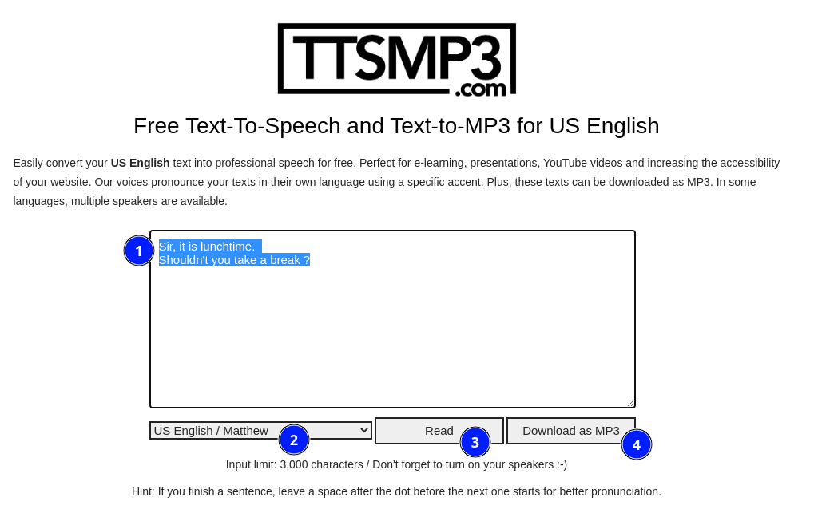

Sometimes you might need to have some audio sound based on text. Such tools are called TTS (Text to Speech).
Many exists but rarely for free.

I share with you one that I particularly like to use for my personal home automation notifications:

It is totally free for a normal usage (Maximum 3K characters a day).

I give you here an example so you can see how easy it is:

# Conclusion

I hope you will enjoy this tool if you have free other online tools to suggest please leave a comment!

Cheers