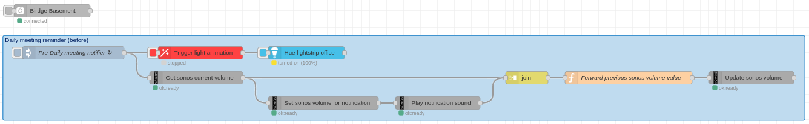
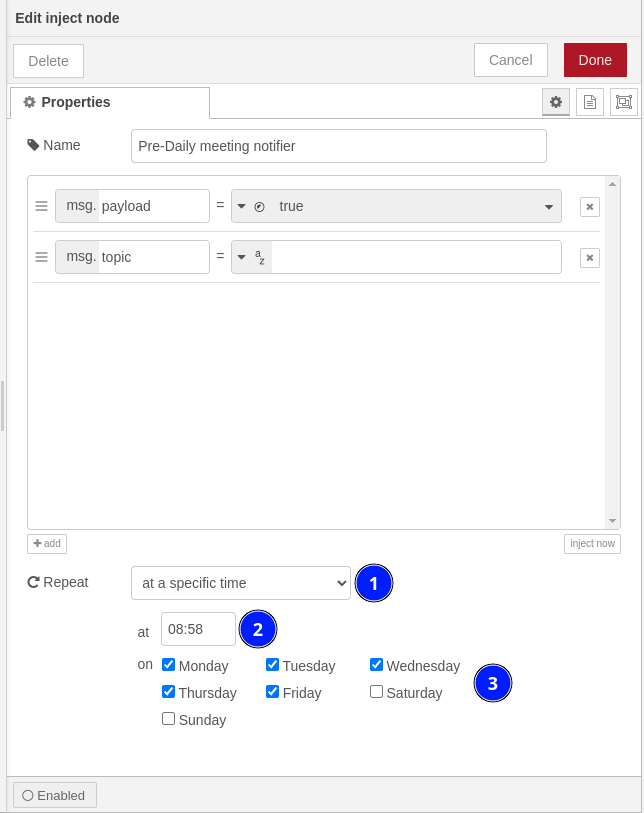

> info "Pre requisiste"
> This article suppose you have a running nodered instance.
> 
> If you don't have one yet have a look [here](https://nodered.org/docs/getting-started/) first.

## Goal

> note "As a passionated programmer I need a reminder at `08:58` each working day (monday to friday)"
> That way if I am totally focussed on my coding session I still get a reminder.

### Acceptance criteria:
* A notification sound will be played in SONOS to remind me about it (audio effect)
  * This sound will be generated using [ttsmp3.com ](https://ttsmp3.com/)free online tool 
    * given text: `Sir, the daily meeting starts in a few. Are you ready ?`
    * voice: `US English / Matthew`
    * note: You can download the mp3 file [here](../assets/audio/daily-meeting-reminder.mp3) directly
* A philips HUE effect will appear on my led strip (visual effect)

This way we have some fallback in the system and can reduce late joins of 99.9% :+1:
 
### Implementation using NodeRed

In order to achieve that we will need two nodered extensions:
* Sonos
* Hue

> warning ""
> TO COMPLETE

Basically here we will have the following flow:



First we trigger this only at `08:58` during working days:



> warning "Warning"
> Node red will use the timezone defined in your instance. (If you run under docker you can define it via the env `TZ=Europe/Paris` or something else based on your region.)
>
> (This concerns point 2) of the screenshot)

Then we trigger some actions 

> warning ""
> TO COMPLETE

Here is the snippet of code that you can import into node red directly:
```json
// TO DO
```

## References
